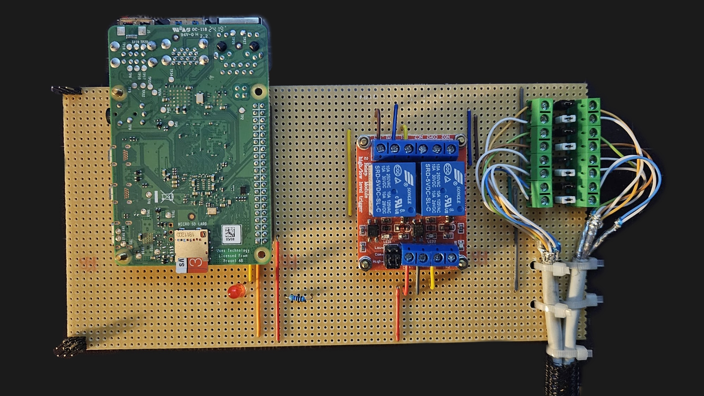

# Smart-Desk

This is a personal project to control my standing desk using a Raspberry Pi 4. The setup is specifically tailored to my hardware and requirements and is not intended for general customization. However, feel free to use it if you find it helpful.

# Hardware

## Hardware Information

- Motor controller ID: WP-CB01
- Control panel circuit board ID: DCU_G-PRT5G

## Steps to Get This Project Working

I installed the Raspberry Pi between the motor controller and the control panel.<br> Therefore, I cut the cable connecting the control panel to the controller and soldered an Ethernet connector to both ends.<br>
The phases of my Ethernet cable are mapped as follows to the desk's cables:

| Ethernet     | Desk   | Function |
| ------------ | ------ | -------- |
| Orange       | Red    | Key1     |
| Orange-White | Yellow | +35V     |
| Green        | Green  | +5V      |
| Green-White  | White  | RX       |
| Brown        | Brown  | Ground   |
| Brown-White  | Black  | TX       |
| Blue         | Purple | Ground   |
| Blue-White   | -      | -        |

### Circuit Diagram

In case the Raspberry Pi and the control panel both send signals at the same time, I built in a relay that controls which one can write. <br> The desk is connected to NC, so even if the Pi is offline, the desk works as usual.

### PCB

To make it more secure for the long term, I soldered everything to a PCB with a line grid.



I mapped the cables from top to bottom as following to the pcb:
- Key1
- +35V
- +5V
- GND
- RX
- TX
- GND

# Software

- Serial ports on the Raspberry Pi must be enabled.

## Used Libraries

```bash
pip install pyserial
pip install flask
pip install flask-classful
pip install rpi.gpio
pip install python-dotenv
pip install mariadb
```
